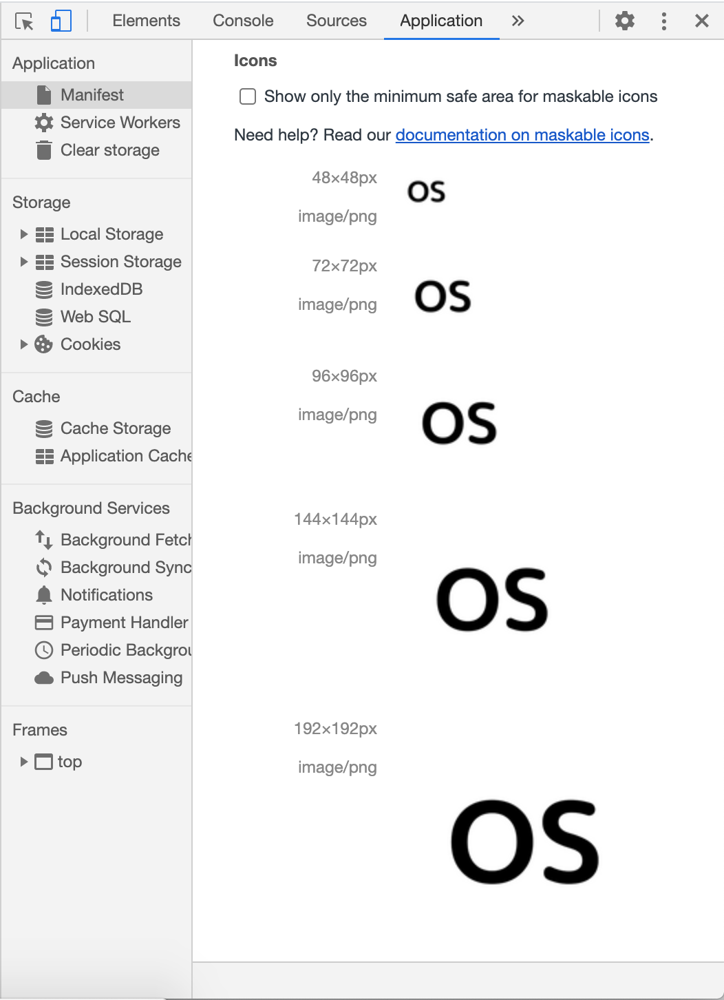
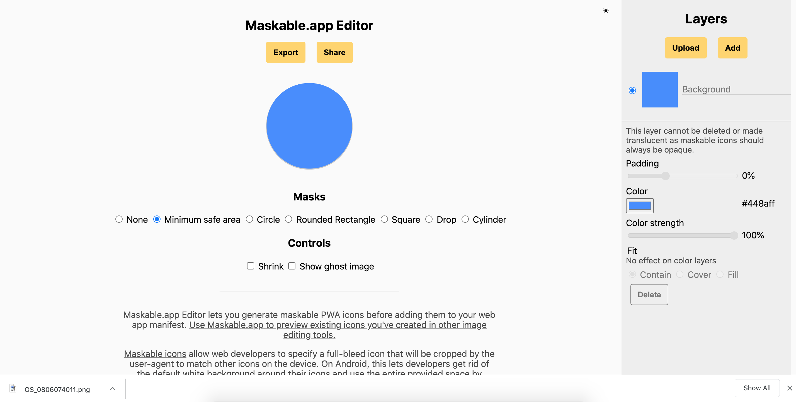
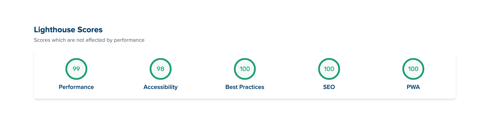
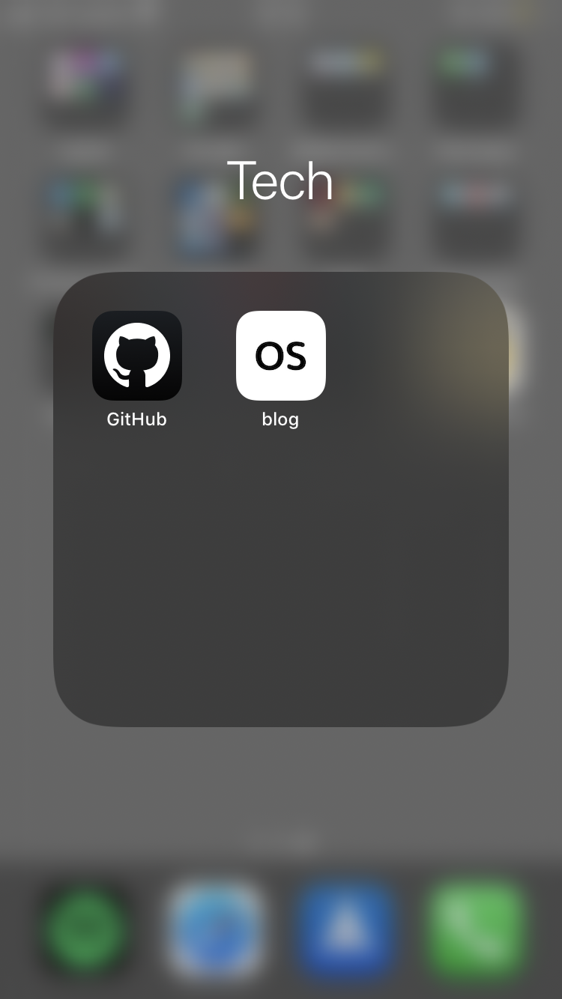

## はじめに

Gatsbyで作ったブログをPWAに対応しました:tada:

PWA(Progressive Web App)とはWebページ/アプリでもネイティブアプリのようなUXを提供するためのもので、Googleが中心となって策定しています。

PWA対応するとページ読み込み速度向上やオフラインでも動いたり、スマホのホーム画面に追加できたりなどのメリットがあります。

Gatsbyでは[デフォルトのスターター](https://www.gatsbyjs.org/starters/?v=2)をインストールした時点で、PWA用のプラグイン(下記2つ)が導入済みなので、簡単な設定をするだけでPWAに対応できてしまいます。

* [gatsby-plugin-manifest](https://www.gatsbyjs.org/packages/gatsby-plugin-manifest/)
* [gatsby-plugin-offline](https://www.gatsbyjs.org/packages/gatsby-plugin-offline)

(スターターによっては初期インストールされていない場合がありますので注意してください)


## gatsby-plugin-manifest

PWA対応で必要となる`manifest.webmanifest`を生成するプラグインです。

```:title=Terminal
// npm
npm install --save gatsby-plugin-manifest

// yarn
yarn add gatsby-plugin-manifest
```

`gatsby-config.js`で設定をします。

```js:title=gatsby-config.js
module.exports = {
  plugins: [
    {
      resolve: 'gatsby-plugin-manifest',
      options: {
        name: 'app name',
        short_name: 'app short_name',
        description: 'app description',
        start_url: `/`,
        background_color: '#fff',
        theme_color: '#fff',
        display: 'minimal-ui',
        icon: 'content/assets/icon.png', // アイコンのパス
        icon_options: {
          purpose: 'maskable', // maskable iconであることを明示する
        },
      },
    },
  ],
}
```

これでサイトをビルドすると自動でサイズ別のアイコンを生成してくれます。

生成された画像はChromeだとデベロッパーツール(Application > Manifest)で確認できます。



または[Maskable​.app Editor](https://maskable.app/editor)を使っても確認や編集ができます。



こちらだとレイヤーを組んで編集できたり、編集した画像をエクスポートできたりするので便利です。


## gatsby-plugin-offline

オフラインでもサイトが動作するように`Service Worker`を生成するプラグインです。  
Service Workerを利用するため、サイトのSSL化が必須ですので注意してください。

```:title=Terminal
// npm
npm install --save gatsby-plugin-offline

// yarn
yarn add gatsby-plugin-offline
```

こちらも`gatsby-config.js`で設定します。

```js:title=gatsby-config.js
{
  plugins: [
    {
      resolve: 'gatsby-plugin-manifest',
      options: {
        ...
      }
    },
    'gatsby-plugin-offline' // 必ずgatsby-plugin-manifestのあとに指定
  ]
}
```

一点注意してほしいのは、両方のプラグインを`gatsby-config.js`に設定するとき、必ず`gatsby-plugin-manifest`を先に書いて、そのあとに`gatsby-plugin-offline`を書く必要があります。


## 確認

本番環境などにデプロイして[lighthouse](https://lighthouse-metrics.com/)でPWA対応できているか確認できます。



スマホのホーム画面にPWA対応したサイトを追加してみると、アプリみたいにアイコンがきちんと設定されています:clap:




## 参考

* [Adding a Manifest File](https://www.gatsbyjs.org/docs/add-a-manifest-file/)
* [Adding Offline Support with a Service Worker](https://www.gatsbyjs.org/docs/add-offline-support-with-a-service-worker/)
* [Add a web app manifest](https://web.dev/add-manifest/)
* [Lighthouse 6 で追加されたPWAの要件にGatsbyJSで対応する](https://ebisu.com/note/lighthouse-6-pwa/)
