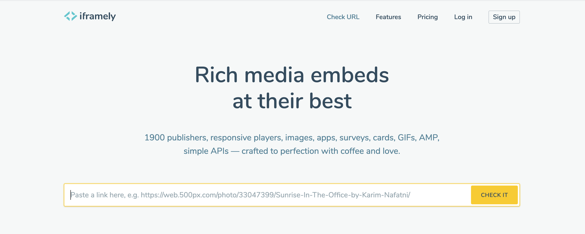
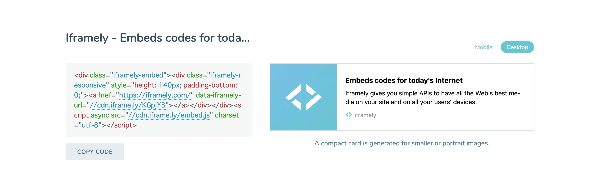

## はじめに

GatsbyJSで開発したこのブログに[Iframely](https://iframely.com/)を導入しました。

Iframelyとは外部サイトへのリンクをリッチコンテンツとして生成してくれるサービスです。

<div class="iframely-embed"><div class="iframely-responsive" style="height: 140px; padding-bottom: 0;"><a href="https://iframely.com/" data-iframely-url="//cdn.iframe.ly/KGpjY3"></a></div></div>

こんな感じで外部サイトへのリンクを貼るときに、そのサイトのサムネイルとディスクリプションがあるカード型リンクが自動で生成されます。見栄えがいい感じになります。

> Free "Developer" tier gives 1000 hits/mo for dev purposes

とのことで1000リクエスト/月までなら無料となります。  
1000リクエスト以上だと[プラン](https://iframely.com/plans)によって値段が変わります。


## Iframelyの使い方

[Iframely](https://iframely.com/embed)にアクセスして埋め込みリンク化したいURLを入力します。



すると埋め込み用のコードが生成されるので、記事中に貼り付けます。



埋め込みコードがどのように表示されるかプレビューも見られます。

これだけでIframely側が良しなにブログカードでリンク展開をしてくれます。


## GatsbyJSで使用する

このブログは[GatabyJS](https://www.gatsbyjs.com/)で構築されています。  
GatsbyJSでIframelyを使う手順を説明します。


### Iframelyコンポーネント

はじめにIframelyのコードをheadタグで読み込むためにコンポーネントを作成します。

```js:title=components/iframely.js
import React, { useEffect } from 'react';
import { Helmet } from 'react-helmet';

const Iframely = () => {
  useEffect(() => {
    if (window && window.iframely) {
      window.iframely.load();
    }
  }, []);

  return (
    <Helmet>
      <script async src="https://cdn.iframe.ly/embed.js" charset="utf-8"></script>
    </Helmet>
  );
};

export default Iframely;
```

やっていることは、吐き出された埋め込みコードの末尾に付いているscriptタグを`react-helmet`を使ってCDNで読み込んでいます。これでサイトのheadタグ内でIframely用のscriptタグが読み込まれます。


### テンプレートで読み込み

上記で作成したIframelyコンポーネントを記事テンプレートでインポートします。

```js{7,20}:title=template/blog-post.js
import React from "react"
import { Link, graphql } from "gatsby"
import Bio from "../components/bio"
import Layout from "../components/layout"
import SEO from "../components/seo"
import { rhythm, scale } from "../utils/typography"
import Iframely from "../components/iframely"

const BlogPostTemplate = ({ data, pageContext, location }) => {
  const post = data.markdownRemark
  const siteTitle = data.site.siteMetadata.title
  const { previous, next } = pageContext

  return (
    <Layout location={location} title={siteTitle}>
      <SEO
        title={post.frontmatter.title}
        description={post.frontmatter.description || post.excerpt}
      />
      <Iframely />
      <article>
        <header>
          <h1
            style={{
              marginTop: rhythm(1),
              marginBottom: 0,
            }}
          >
            {post.frontmatter.title}
          </h1>
          <p
            style={{
              ...scale(-1 / 5),
              display: `block`,
              marginBottom: rhythm(1),
            }}
          >
            {post.frontmatter.date}
          </p>
        </header>
        <section dangerouslySetInnerHTML={{ __html: post.html }} />
        <hr
          style={{
            marginBottom: rhythm(1),
          }}
        />
        <footer>
          <Bio />
        </footer>
      </article>

      <nav>
        <ul
          style={{
            display: `flex`,
            flexWrap: `wrap`,
            justifyContent: `space-between`,
            listStyle: `none`,
            padding: 0,
          }}
        >
          <li>
            {previous && (
              <Link to={previous.fields.slug} rel="prev">
                ← {previous.frontmatter.title}
              </Link>
            )}
          </li>
          <li>
            {next && (
              <Link to={next.fields.slug} rel="next">
                {next.frontmatter.title} →
              </Link>
            )}
          </li>
        </ul>
      </nav>
    </Layout>
  )
}

export default BlogPostTemplate

export const pageQuery = graphql`
  query BlogPostBySlug($slug: String!) {
    site {
      siteMetadata {
        title
      }
    }
    markdownRemark(fields: { slug: { eq: $slug } }) {
      id
      excerpt(pruneLength: 160)
      html
      frontmatter {
        title
        date(formatString: "MMMM DD, YYYY")
        description
      }
    }
  }
`
```


### 記事に埋め込みコードを貼る

あとはマークダウンなどに吐き出されたコードを埋め込みます。  
URLの末尾についているscriptタグはコンポーネントで既に読み込んであるので削除します。

```:title=sample
<div class="iframely-embed"><div class="iframely-responsive" style="height: 140px; padding-bottom: 0;"><a href="https://blog.otsukasatoshi.com/" data-iframely-url="//cdn.iframe.ly/x3oLq2P?iframe=card-small"></a></div></div>
```

**表示サンプル**

<div class="iframely-embed"><div class="iframely-responsive" style="height: 140px; padding-bottom: 0;"><a href="https://blog.otsukasatoshi.com/" data-iframely-url="//cdn.iframe.ly/x3oLq2P?iframe=card-small"></a></div></div>

いい感じにGatsbyJSのサイトでもブログカードを表示することができました:+1:


## 参考

* [ブログにあらゆる外部コンテンツを埋め込めるWebサービス「Iframely」の使い方](https://takumon.com/iframely)
* [ブログに外部コンテンツを良い感じに埋め込むならIframelyがオススメ！](https://www.mono7555e.com/iframely/)
* [Gatsbyサイトの外部リンクをiframelyでいい感じに表示](https://startuphacker.net/gatsby-iframely/)
* [GatsbyJSブログの記事にiframelyで良い感じに外部リンクを埋め込んだ](https://rpf-noblog.com/2020-07-08/gatsby-iframely/)
