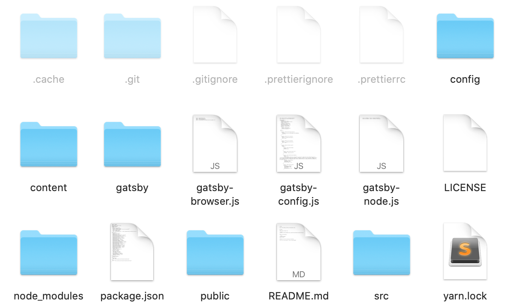
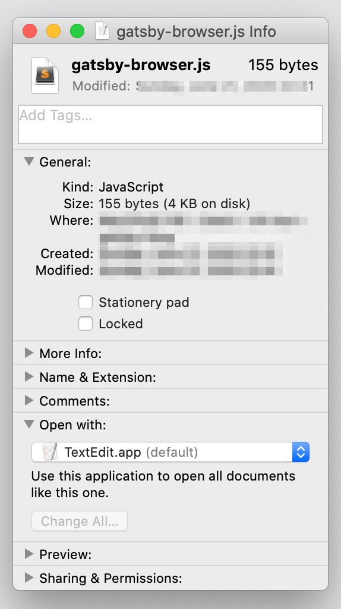
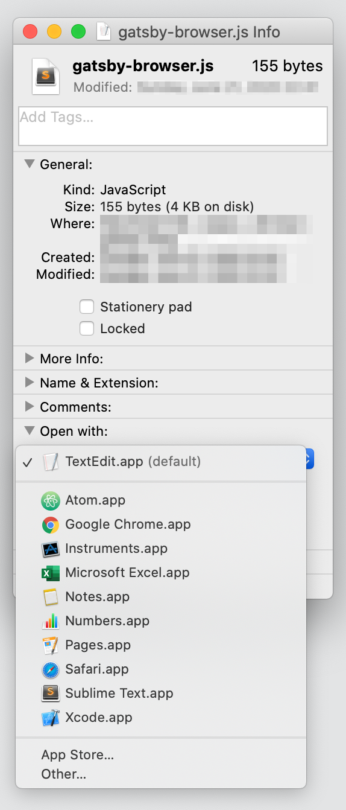
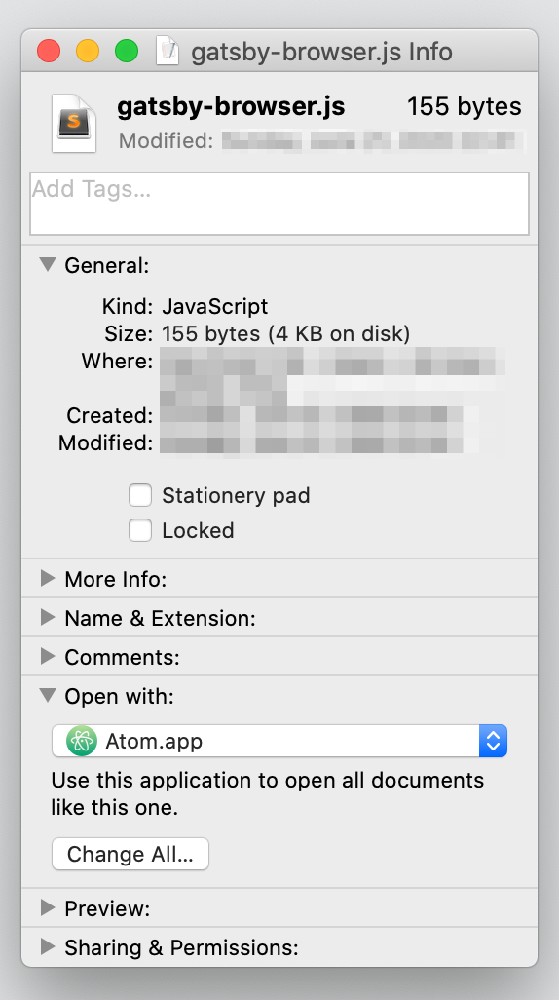
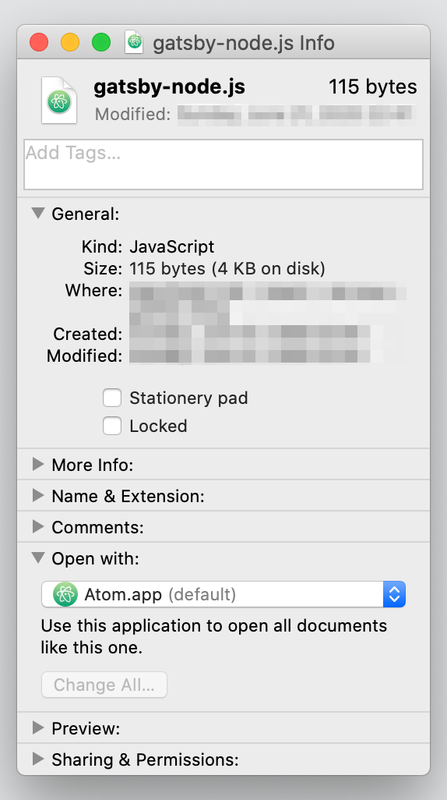

## はじめに

MacではFinderなどからソースコードを開くとき、デフォルトではアプリ一覧の`その他`に入っている`テキストエディット`が開かれる設定となってます。

これでも勿論いいのですが、普段から別のエディタを使用している場合、デフォルトでそれらのテキストエディタで開いてくれた方がうれしいですよね？

一度設定さえしてしまえば、次回以降設定したエディタで開けるので便利になります。

## 適当なファイルを選択

まずはじめに、デフォルトで開きたい拡張子ファイルをFinderなどから選択しましょう。
選ぶファイルは適当で大丈夫です。

例えば`JavaScript`のファイルを指定のテキストエディタで開きたい場合、拡張子が`.js`のファイルのものを選びます。

##  テキストエディタを選択

選んだファイルを右クリックすると、メニューが出ます。
その中に`情報を見る`という項目があるのでクリックします。

すると以下の様に選択したファイルについての情報が表示されます。

この時点では`TextEdit.app`がデフォルトで選択されているのがわかると思います。

プルダウンのところをクリックすると選択できるテキストエディタ一覧が表示されるので、自分がデフォルトで開きたいエディタを選択します。

ここではAtomを選んでみました。  
選択したら下にある`すべてを変更...`をクリックします。

すると確認ダイアログが表示されるので続けるをクリックします。

## 確認

これで拡張子が`.js`のファイルを今後開くとき、デフォルトでAtomが開かれるようになりました。 試しに別のファイルを開いてみましょう。

きちんとデフォルトのテキストエディタがAtomで設定されています。

今回は拡張子`.js`の例で説明しましたが、他の拡張子のファイルも同様に設定することが可能なので各自設定しておくといいかもしれません。
