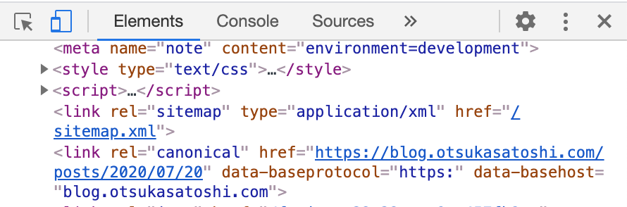

## はじめに

Gatsbyで作ったブログにcanonicalタグを導入しました。

canonicalタグはURLの正規化をするもので、SEO対策の一つとして有効です。

Gatsbyでcanonicalタグはプラグインを導入するか、SEOコンポーネントで現在のURLを取得してcanonicalタグをhead内に設定する方法がありますが、今回はプラグインを導入するやり方で説明します。


## インストール

まず[gatsby-plugin-canonical-urls](https://www.gatsbyjs.org/packages/gatsby-plugin-canonical-urls/)というプラグインをインストールします。

```:title=terminal

// npm
npm install --save gatsby-plugin-canonical-urls

// yarn
yarn add gatsby-plugin-canonical-urls

```

プラグインのインストールはこれで完了です。


## 設定

次に`gatsby-config.js`に設定をしていきます。

```js:title=gatsby-config.js

// In your gatsby-config.js
plugins: [
  {
    resolve: `gatsby-plugin-canonical-urls`,
    options: {
      siteUrl: `https://www.example.com`,
    },
  },
]

```

ベースとなるURLを`siteUrl`に設定するだけです。



headタグ内にcanonicalタグが設定されてます。


## オプション

検索クエリがURLにある場合、`stripQueryString: true,` でクエリ部分をcanonical urlに含まなくできます。

```js:title=gatsby-config.js

module.exports = {
  plugins: [
    {
      resolve: `gatsby-plugin-canonical-urls`,
      options: {
        siteUrl: `https://www.example.com`,
        stripQueryString: true,
      },
    },
  ],
}

```

例えば`foo/search?tag=bar`みたいなURLが`foo/search`となります。


## 最後に

canonicalタグの設定もプラグインを使えばめっちゃ簡単にできました。

Gatsbyすごい :clap:
