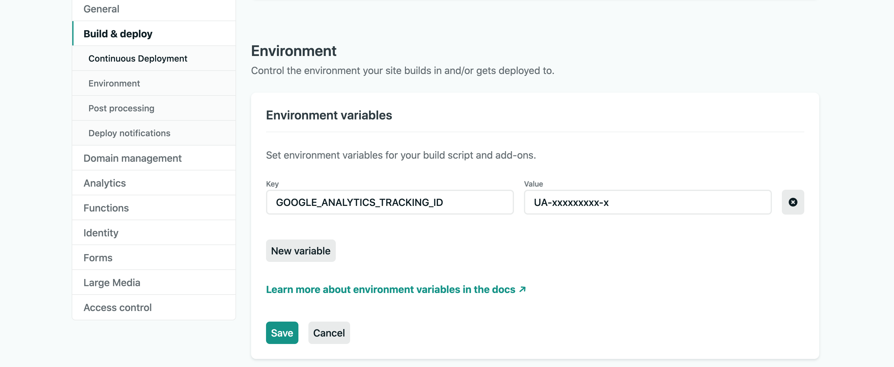

## はじめに

Gatsby.jsで開発したブログにGoogle Analyticsを導入しました。
その時の手順を備忘録として残しておきます。


## トラッキングIDを発行

まずGoogle Analyticsのページで計測するサイト用のトラッキングIDを発行します。
Googleのアカウントで[公式ページ](https://analytics.google.com/analytics/web/)にログインしたら、あとは案内通りに設定していけばOKです。
(詳しい手順は[こちら](https://support.google.com/analytics/answer/1009694?hl=ja)を参照して下さい。)


## プラグインの導入

まず`gatsby-plugin-google-analytics`というプラグインをインストールします。
スターターによってデフォルトでインストールされている場合もあります。

```shell-session:title=Terminal

// npm
npm install --save gatsby-plugin-google-analytics

// yarn
yarn add gatsby-plugin-google-analytics

```

プラグインのインストールは完了です。


## gatsby-config.jsを修正

プラグインの導入が完了したら`gatsby-config.js`に設定を書いていきます。

下記は設定一覧ですが、すべて設定する必要はありません。

```js:title=gatsby-config.js
// In your gatsby-config.js
module.exports = {
  plugins: [
    {
      resolve: `gatsby-plugin-google-analytics`,
      options: {
        // The property ID; the tracking code won't be generated without it
        trackingId: "YOUR_GOOGLE_ANALYTICS_TRACKING_ID",
        // Defines where to place the tracking script - `true` in the head and `false` in the body
        head: false,
        // Setting this parameter is optional
        anonymize: true,
        // Setting this parameter is also optional
        respectDNT: true,
        // Avoids sending pageview hits from custom paths
        exclude: ["/preview/**", "/do-not-track/me/too/"],
        // Delays sending pageview hits on route update (in milliseconds)
        pageTransitionDelay: 0,
        // Enables Google Optimize using your container Id
        optimizeId: "YOUR_GOOGLE_OPTIMIZE_TRACKING_ID",
        // Enables Google Optimize Experiment ID
        experimentId: "YOUR_GOOGLE_EXPERIMENT_ID",
        // Set Variation ID. 0 for original 1,2,3....
        variationId: "YOUR_GOOGLE_OPTIMIZE_VARIATION_ID",
        // Defers execution of google analytics script after page load
        defer: false,
        // Any additional optional fields
        sampleRate: 5,
        siteSpeedSampleRate: 10,
        cookieDomain: "example.com",
      },
    },
  ],
};
```

`trackingId`に発行されたトラッキングIDを書けばOKです。

しかし、**これだけでは動きません。**

デフォルトだと`head`オプションが`false`になっています。
このままだとサイトタグがbody要素に配置されてしまいます。

[公式サイト](https://support.google.com/analytics/answer/1008080?hl=ja)に

> タグは、各ページの最初のheadタグの直後に追加します。

と書かれている通りに、`<head>`タグ内に配置しなければなりません。

なので、`head`オプションを`true`に設定します。

また`gatsby-plugin-google-analytics`は`gatsby-config.js`の先頭に書きます。
(先頭で読み込まないと正常に動作しない場合があるみたいです。[プラグイン公式ページ](https://www.gatsbyjs.org/packages/gatsby-plugin-google-analytics/)にもトラブルシューティングで載っています。)

```js:title=gatsby-config.js
module.exports = {
  plugins: [
    {
      resolve: "gatsby-plugin-google-analytics",
      options: {
        trackingId: "UA-xxxxxxxxx-x", // トラッキングID
        head: true, // <head>タグ直後に読み込む
      },
    },
    // 以下ほかのプラグイン読み込み
  ],
};
```

これでサイトを本番環境にデプロイすればグーグル・アナリティクスが動いているはずです。


## Netlifyと連携

configファイルにトラッキングIDをベタ書きしてもいいですが、見られたくない人もいると思います。
方法はいくつかありますが、自分はNetlifyにデプロイしているのでNetlifyで環境変数を仕込むやり方を説明します。

Netlifyで対象のサイトの設定ページにいきます。
`Site settings`ボタンを押下すると`Build & deploy`というメニューがあります。
`Build & deploy -> Environment -> Environment variables`という項目があるので、ここに環境変数を登録します。

環境変数は`key`と`value`の組み合わせで設定します。
`key`に環境変数名、`value`に発行されたトラッキングIDを入力して登録すればOKです。



あとはGatsby側でNetlifyに設定した環境変数を読み込みます。

```js:title=gatsby-config.js
module.exports = {
  plugins: [
    {
      resolve: "gatsby-plugin-google-analytics",
      options: {
        trackingId: process.env.GOOGLE_ANALYTICS_TRACKING_ID, // Netlify側で設定した環境変数名
        head: true,
      },
    },
  ],
};
```

これでNetlifyと連携してトラッキングIDを隠しつつアナリティクスの設定ができました。
