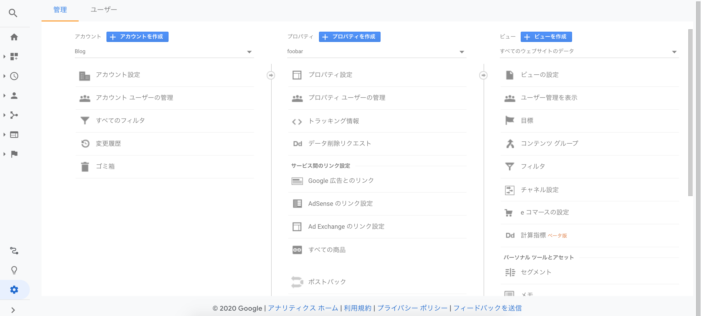
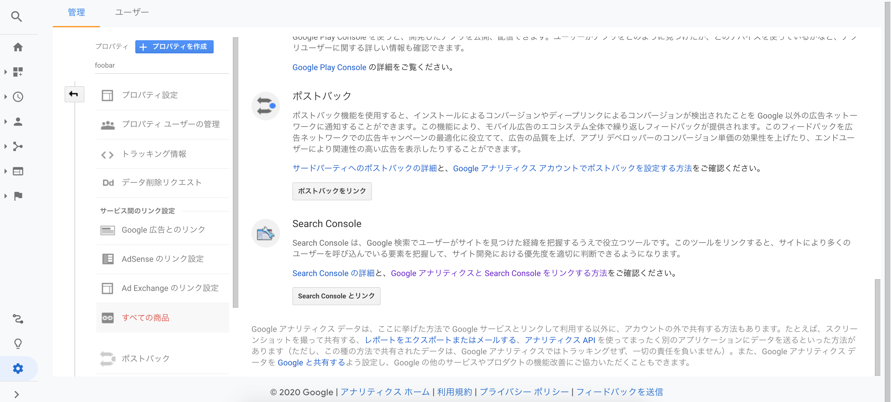
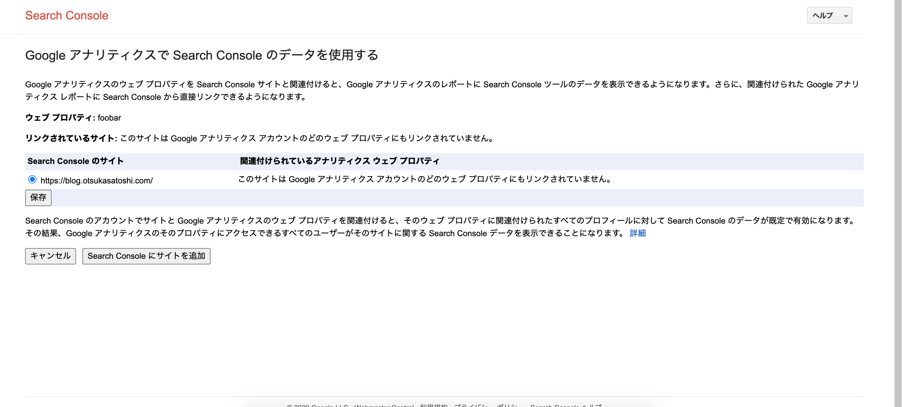
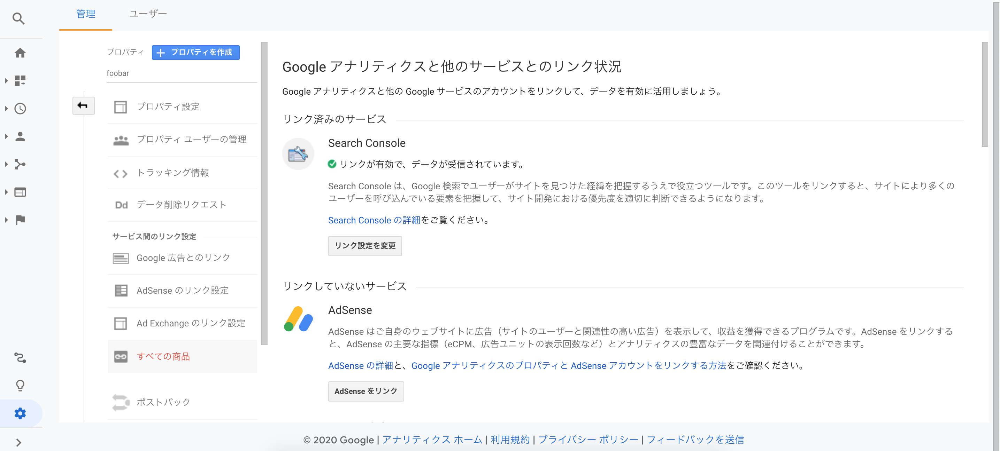

## 前提条件

Google Search Consoleを導入する方法はいくつかありますが、今回はGoogle Analyticsと連携する方法で説明します。

Google Analyticsをサイトに導入していない場合は、[過去記事](https://blog.otsukasatoshi.com/posts/2020/06/25)を参考に導入してください。

## 連携

まずアナリティクスのプロパティ列にあるすべての商品をクリックします。

一番下にSearch Consoleとリンクというボタンがあるのでクリックします。

クリックしたらサーチコンソールのサイトに遷移します。

ドメインとプレフィックスどちらか選択できますが、プレフィックスのほうが連携が楽なので今回はプレフィックスを選択してサイトのURLを入力し続行を押下します。(Google的にはドメインを推奨しているみたいです。こちらだとDNSの設定が必要になるので若干手間がかかります。)

特に問題なければ自動で所有権の認証がOKになるはずです。

サーチコンソールで所有権が確認できたURLが表示されるので、ラジオボタンをチェックして保存を押下します。

もう一度プロパティ列のすべての商品を確認すると、リンク済みのサービスにSearch Consoleが表示されているはずです。

以上でGatsby製サイトにサーチコンソールを導入することができました。

## 最後に

サーチコンソールはサイトマップも送れるので、次回以降にGatsby製サイトにサイトマップを導入する方法も書いていきたいと思います。
