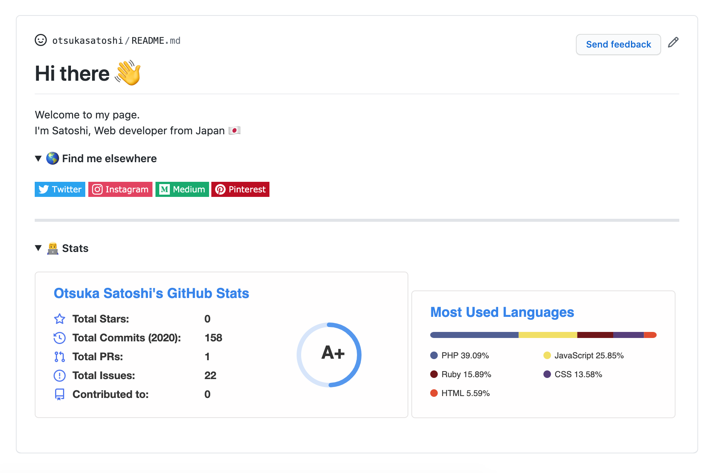
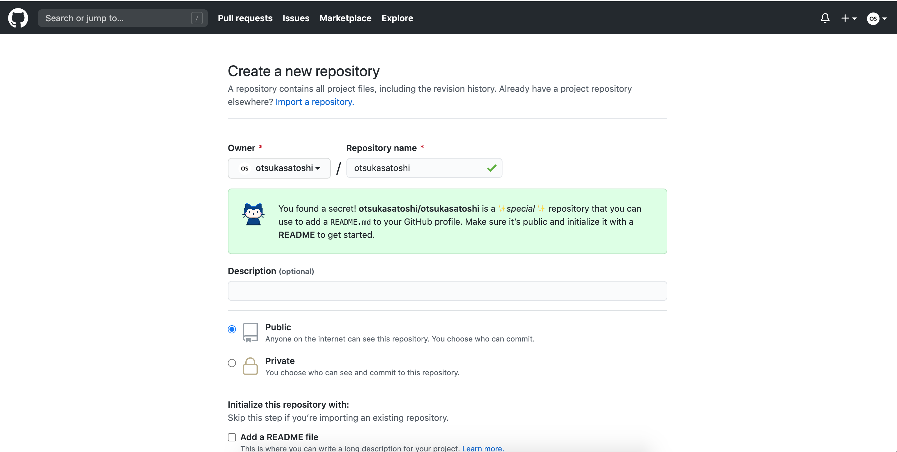
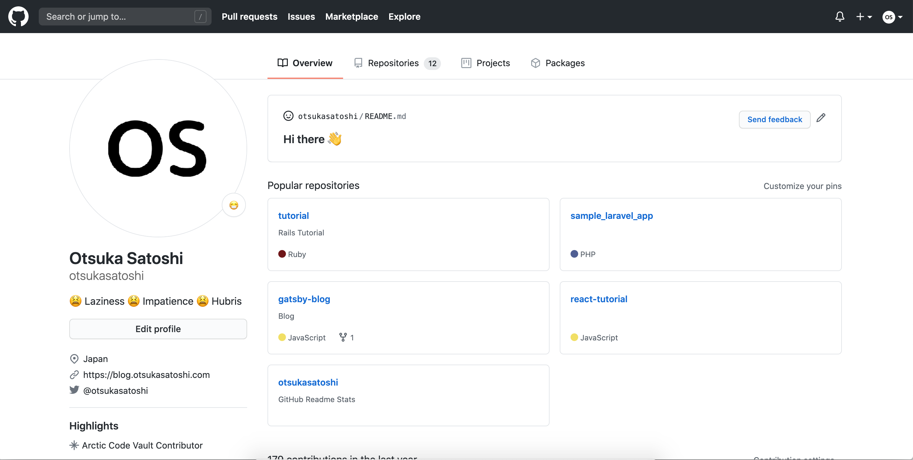

## はじめに

GitHubではユーザーのプロフィール画面にREADMEを表示できる機能があります。

具体的には、以下のようにGitHubプロフィールの上部にREADMEを表示できるようになります。



これはまだ隠し機能？みたいなので保証はできませんが、たぶんアカウントを持っていれば作れるはずです。


## リポジトリを作る

まず自分のGitHubのユーザーネームと同じ名前のリポジトリを作成します。



README.mdを自動作成しておきたいので **Add a README file** にチェックを入れておきます。

そのままPushして、自分のプロフィール画面に戻ってみると初期画面が表示されているはずです。



あとは、このファイルをマークダウンで自分好みに修正していくだけです。


## shields.io

[shields.io](https://shields.io/)というサービスを使うとバッチを作成できます。
(よくREADMEにCI/CDのステータスとかバージョンとかがあるバッチです)

ここで自分の好きなデザインを選んでSNSとかのアカウントをバッチで表示できます。

```
[](https://twitter.com/otsukasatoshi)
```

上記はTwitterを例にしています。
URLの部分を自分のアカウント名に変更してください。

バッチのデザインは他にもあるので好みのものを見つけましょう。


## GitHub Readme Stats

[GitHub Readme Stats](https://github.com/anuraghazra/github-readme-stats)というサービスを使えば、自分のコミット数とか使用している言語の割合を自動で生成してくれます。:+1:

README.mdで下記のURLを埋め込めば良しなにやってくれます。

```
[](https://github.com/otsukasatoshi)

[](https://github.com/otsukasatoshi)
```

`username=`となっているところを自分のユーザー名に変更してください。

statsの数にプライベートリポジトリを含める、背景色を変えるといったオプションもいろいろ用意されています。
自分好みにカスタマイズしてみましょう！


## 完成

完成するとこんな感じでリッチなデザインでstats情報が表示できます。


いろいろな開発者のプロフィールをみるのも楽しいです。

ぜひ自分だけのGitHubプロフィールを作ってみてください:smile:
